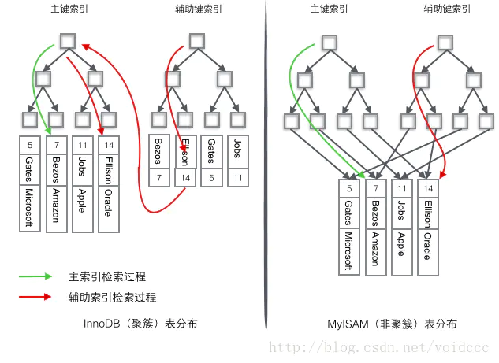

# 索引记录

## 1. 索引的作用

索引是一种用于快速查找的数据结构，可以利用数据的特性来减少查询的次数

## 2. 常用算法

- 二叉树 
    二叉查找树适用于内存，在某些条件下会退化成线性链表
- 红黑树
    一种平衡二叉树，虽然高度会进行自动调控，但是在大数据量下树的高度是限制查询数据的瓶颈
- hash
    对索引元素的值做一次hash运算就可以在hash映射表里快速找到这一行的磁盘文件地址，经过一次hash就可以快速定位到索引所在行的磁盘文件地址，hash这么快，表有一亿个数据按这种算法，那也就可能经历一次hash运算就可以快速找到某页任意一行数据元素的所在的磁盘文件地址,但是由于在查询数据时会是使用到范围查询，因此hash也不太适合做mysql索引
- B-Tree 或B+Tree
    mysql 用 B+tree 作为底层索引，B树和B+树的主要区别是
    * B树的每个节点都存储来Key和Data，组成这个树，并且叶子节点为NIL
    * B+树中只有叶子节点存储了key和Data，非叶子节点之存储主键，这样每个节点可以存储更多的key索引节点，使这棵树更矮，减少磁盘IO，查询效率更高，

    另外在B+树的结构基础上有加上了顺序访问指针，也就是每个叶子节点增加一个指向相邻叶子节点的指针，这样对于区间查询的效率有所提高，因此B+树更适合做索引

## 3. InnoDB和MYISAM 索引对比

在myisam中，使用非聚簇索引，索引和数据文件是分离的，在索引文件的叶节点保留有数据节点的文件指针，查询的步骤是先查找索引文件找到所有的数据地址，在从数据文件中获取数据

而在InnoDB中，使用聚簇索引，索引和数据是在一个文件中的。 而对于辅助索引，叶子节点存储的是数据的主键，因此通过辅助索引查询时，先查找到主键，然后在通过主键查询数据

### 3.1 聚簇索引和非聚簇索引

聚簇索引：将数据存储与索引放到了一个文件中，找到索引也就找到了数据, 因此聚簇索引具有唯一性，即一张表只会有一个聚簇索引
非聚簇索引：将数据存储于索引分开结构，索引结构的叶子节点指向了数据的对应行

innodb中，在聚簇索引之上创建的索引称之为辅助索引，辅助索引访问数据总是需要二次查找，非聚簇索引都是辅助索引，像复合索引、前缀索引、唯一索引，辅助索引叶子节点存储的不再是行的物理位置，而是主键值

### 3.2 聚簇索引的优势和劣势

在聚簇索引中，如果使用辅助索引，那么需要先查询处主键，然后再用主键查询数据，需要查询两次，而非聚簇索引只需一次，那么为什么还要使用聚簇索引？

1. 保证数据一致性，在辅助索引中也是最终通过主键来获取数据
2. 数据和索引在同一文件内，可以避免数据回表，直接获取数据
3. 辅助索引使用主键作为"指针"而不是使用地址值作为指针的好处是，减少了当出现行移动或者数据页分裂时辅助索引的维护工作，使用主键值当作指针会让辅助索引占用更多的空间，换来的好处是InnoDB在移动行时无须更新辅助索引中的这个"指针"

由于索引是昂贵的，因此聚簇索引也有其劣势：

 - 维护索引很昂贵，特别是插入新行或者主键被更新导至要分页(page split)的时候。建议在大量插入新行后，选在负载较低的时间段，通过OPTIMIZE TABLE优化表，因为必须被移动的行数据可能造成碎片。使用独享表空间可以弱化碎片
- 表如果使用UUId做主键，使数据存储稀疏，这就会出现聚簇索引有可能有比全表扫面更慢

### 3.2 自增型主键

在mysql中，如果不设定主键，那么mysql是自动使用隐藏的rowid作为主键来建立索引，但一般推荐使用自增型整型来作为主键

聚簇索引的数据的物理存放顺序与索引顺序是一致的，即：只要索引是相邻的，那么对应的数据一定也是相邻地存放在磁盘上的。如果主键不是自增id，那么它可能会不断地调整数据的物理地址、分页，当然也有其他一些措施来减少这些操作，但却无法彻底避免。如果是自增的，它只需要``一页一页``地写，索引结构相对紧凑，磁盘碎片少，效率也高。

因为MyISAM的主索引并非聚簇索引，那么他的数据的物理地址必然是凌乱的，拿到这些物理地址，按照合适的算法进行I/O读取，于是开始不停的寻道不停的旋转。聚簇索引则只需一次I/O。

也因此聚簇索引比非聚簇索引更适合做范围查询和排序查询

还有一点是整型作为主键暂用空间小，可以在一次磁盘IO中尽可能的查询更多的数据

## 4. 联合索引查询

联合索引遵循的是最左匹配原则，例如创建所以``i_index(a,b,c)`` 相当远创建了索引 ``i_index(a)``,``i_index(a,b)``,``i_index(a,b,b=c)``  联合索引的排序是先比较a,如果a相等在比较b索引，如果b相等在比较c索引

## 5. 多索引

- MYSQL查询中，有没有可能多个索引一起用

有可能， 从mysql5之后引入了"索引合并"功能,只要俩个索引的查询结果集有序，那么就可以对两个索引进行合并查询，但是一般这种情况大概率是索引设计不合理，应考虑设计，尽可能规避改情况
具体参考：https://www.miaokee.com/55536.html

//TODO 

## 7. 参考链接

[MySQL索引那些事](https://mp.weixin.qq.com/s?__biz=MzUxNTQyOTIxNA==&mid=2247484041&idx=1&sn=76d3bf1772f9e3c796ad3d8a089220fa&chksm=f9b784b8cec00dae3d52318f6cb2bdee39ad975bf79469b72a499ceca1c5d57db5cbbef914ea&token=2025456560&lang=zh_CN#rd)
[联合索引在B+树上的存储结构及数据查找方式](https://juejin.im/post/5e57ac99e51d45270e212534?utm_source=gold_browser_extension)

