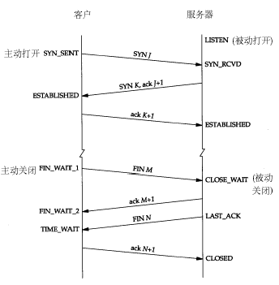

.. highlight:: rst

.. _records_base_web_tcp-hand:

TCP 三次握手和四次挥手
=========================

三次握手
:::::::::

初始状态客户端处于 ``closed`` 的状态，服务端处于 ``listen`` 状态

    1、第一次握手：客户端给服务端发一个 SYN 报文，并指明客户端的初始化序列号 ISN(c)。此时客户端处于 SYN_Send 状态。

    2、第二次握手：服务器收到客户端的 SYN 报文之后，会以自己的 SYN 报文作为应答，并且也是指定了自己的初始化序列号 ISN(s)，同时会把客户端的 ISN + 1 作为 ACK 的值，表示自己已经收到了客户端的 SYN，此时服务器处于 SYN_REVD 的状态。

    3、第三次握手：客户端收到 SYN 报文之后，会发送一个 ACK 报文，当然，也是一样把服务器的 ISN + 1 作为 ACK 的值，表示已经收到了服务端的 SYN 报文，此时客户端处于 establised 状态。

    4、服务器收到 ACK 报文之后，也处于 establised 状态，此时，双方以建立起了链接

只有经过三次握手，双方都确认了彼此的接收能力正常，才开始互相通信

问题
'''''''
1、（ISN）是固定的吗?

  三次握手的一个重要功能是客户端和服务端交换ISN(Initial Sequence Number), 以便让对方知道接下来接收数据的时候如何按序列号组装数据,如果ISN固定，那么很容易被攻击

2. 什么是半连接队列

  服务器第一次收到客户端的 SYN 之后，就会处于 SYN_RCVD 状态，此时双方还没有完全建立其连接，服务器会把此种状态下请求连接放在一个队列里，我们把这种队列称之为半连接队列

3. 三次握手过程中可以携带数据吗

  第三次握手可以携带数据，因为此时客户端已经确定服务端是可接收状态，因此可以携带数据，但第一和第二次不可以，因为攻击者根本就不理服务器的接收、发送能力是否正常，然后疯狂着重复发 SYN 报文的话，这会让服务器花费很多时间、内存空间来接收这些报文，造成服务器被攻击

四次挥手
:::::::::::::::

初始状态，客户端和服务器都处于 establised 状态,彼此双方都可以主动发起关闭，效果是一样的。
加入客户端主动关闭， 四次挥手流程如下： 

.. image:: ../../pictures/base/web/tcp_four_bye.png

- 第一次挥手：客户端发送一个 FIN 报文，报文中会指定一个序列号。此时客户端处于CLOSED_WAIT1状态。

- 第二次握手：服务端收到 FIN 之后，会发送 ACK 报文，且把客户端的序列号值 + 1 作为 ACK 报文的序列号值，表明已经收到客户端的报文了，此时服务端处于 CLOSE_WAIT2状态。

- 第三次挥手：如果服务端也想断开连接了，和客户端的第一次挥手一样，发给 FIN 报文，且指定一个序列号。此时服务端处于 LAST_ACK 的状态。

- 第四次挥手：客户端收到 FIN 之后，一样发送一个 ACK 报文作为应答，且把服务端的序列号值 + 1 作为自己 ACK 报文的序列号值，此时客户端处于 TIME_WAIT 状态。需要过一阵子以确保服务端收到自己的 ACK 报文之后才会进入 CLOSED 状态

- 服务端收到 ACK 报文之后，就处于关闭连接了，处于 CLOSED 状态

挥手中的状态解释
'''''''''''''''''

FIN_WAIT1
""""""""""""

当一方接受到来自应用断开连接的信号时候，就发送 FIN 数据报来进行主动断开，并且该连接进入 FIN_WAIT1 状态，连接处于半段开状态(可以接受、应答数据，当不能发送数据)，并将连接的控制权托管给 Kernel，程序就不再进行处理

``tcp_orphan_retries`` ：Integer，这里系统参数默认为 9, 是近端丢弃 TCP 连接的时候，重试次数,适当的减小，可以减少异常连接在系统中的存活时间

``tcp_max_orphans`` ：Integer，默认值 8096。系统所能处理不属于任何进程的 TCP sockets 最大数量。当超过这个值所有不属于任何进程的 TCP 连接(孤儿连接)都会被重置,主要是防dos

FIN_WAIT2
""""""""""""""""""

当主动断开一端的 FIN 请求发送出去后，并且成功够接受到相应的 ACK 请求后，就进入了 FIN_WAIT2 状态,FIN_WAIT1 和 FIN_WAIT2 状态都是在等待对方的 FIN 数据报。当 TCP 一直保持这个状态的时候，对方就有可能永远都不断开连接，导致该连接一直保持着

``tcp_fin_timeout`` ：Integer，默认 60，单位秒，不属于任何应用的孤儿连接保持 FIN_WAIT2 状态的最长时间，一当超过这个时间，就会被本地直接关闭，不会进入 TIME_WAIT 状态

TIME_WAIT
""""""""""

当前面的步骤都顺利完成了，并且接受到了 被动关闭端 发送过来的 FIN 数据报后，系统做出 ACK 应答后，该连接就进入了尾声，也就是 TIME_WAIT 状态。内核会设定一个时间长度为 2MSL 的定时器，当定时器在到时间点后，内核就会将该连接关闭。反之，当连接尚未关闭的时候，又收到了对方发送过来的 FIN 请求（可能是我们发送出去的请求对方并未收到），或者收到 ICMP 请求（比如 ACK 数据报，在网络传输中出现了错误），该连接就会重新发送 ACK 请求，并重置定时器

``MSL`` 是Maximum Segment Lifetime,译为“报文最大生存时间”，任何报文在网络上存在的最长时间，超过这个时间报文将被丢弃。等待 2MSL 时间主要目的是怕最后一个 ACK 对方没收到，那么对方在超时后将重发第三次握手的 FIN ，主动关闭端接到重发的 FIN 包后，系统收到该分组后，可以再发一个 ACK 应答包

被动端状态--CLOSE_WAIT
"""""""""""""""""""""""""""""""

当被动关闭端，也就是图中的服务端，接受到了对方发送过来的 FIN 请求，并且对请求做出应答后，该连接就进入了 CLOSE_WAIT ，当连接处于这个状态的时候，该连接可能有数据需要发送，或者一些其他事情要做，当这类连接过多的时候，就会导致网络性能下降，耗尽连接数，无法建立新的连接。

比如连接一直没得到释放，相应的资源一直被占用，一但达到句柄数的上限（ linux 可以通过 ulimit -a 查看 open files 数值，默认1024 ）后，新的请求就无法继续处理，就会返回大量的 Too Many Open Files 错误。

四次挥手的常见错误
''''''''''''''''''''

1. 服务器保持了大量TIME_WAIT状态(主动端状态)

::

    TIME_WAIT是主动关闭连接的一方保持的状态，对于爬虫服务器来说他本身就是“客户端”，
    在完成一个爬取任务之后，他就 会发起主动关闭连接，从而进入TIME_WAIT的状态，
    然后在保持这个状态2MSL（max segment lifetime）时间之后，彻底关闭回收资源

    解决思路很简单，就是让服务器能够快速回收和重用那些TIME_WAIT的资源,即设置系统参数

2.服务器保持了大量CLOSE_WAIT状态(被动端状态)

::

    造成的原因:
    在对方关闭连接之后服务器程 序自己没有进一步发出ack信号。
    换句话说，就是在对方连接关闭之后，程序里没有检测到，或者程序压根就忘记了这个时候需要关闭连接

    所以出现大量的CLOSE_WAIT 主要是需要排查程序，看是否有未关闭的连接

    

