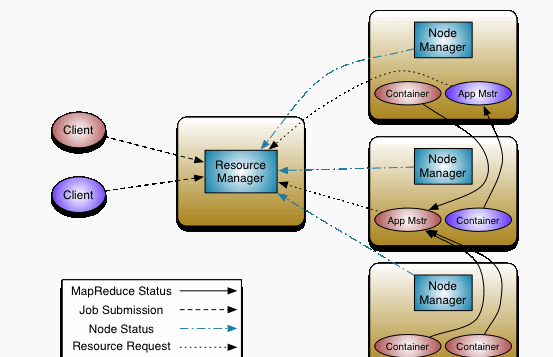

.. highlight:: rst

.. _records_bigdata_hadoop_yarn-base:

yarn
-------------

yarn架构
==========

- ``ResourceManager(RM)`` ：负责对各NM上的资源进行统一管理和调度，将AM分配空闲的Container运行并监控其运行状态。对AM申请的资源请求分配相应的空闲Container。主要由两个组件构成：调度器（Scheduler）和应用程序管理器（Applications Manager）。
- ``调度器（Scheduler）`` ：调度器根据容量、队列等限制条件（如每个队列分配一定的资源，最多执行一定数量的作业等），将系统中的资源分配给各个正在运行的应用程序。调度器仅根据各个应用程序的资源需求进行资源分配，而资源分配单位是Container，从而限定每个任务使用的资源量。Scheduler不负责监控或者跟踪应用程序的状态，也不负责任务因为各种原因而需要的重启（由ApplicationMaster负责）。总之，调度器根据应用程序的资源要求，以及集群机器的资源情况，为用程序分配封装在Container中的资源。调度器是可插拔的，例如CapacityScheduler、FairScheduler。（PS：在实际应用中，只需要简单配置即可）
- ``应用程序管理器（Application Manager）`` ：应用程序管理器负责管理整个系统中所有应用程序，包括应用程序提交、与调度器协商资源以启动AM、监控AM运行状态并在失败时重新启动等，跟踪分给的Container的进度、状态也是其职责。ApplicationMaster是应用框架，它负责向ResourceManager协调资源，并且与NodeManager协同工作完成Task的执行和监控。MapReduce就是原生支持的一种框架，可以在YARN上运行Mapreduce作业。有很多分布式应用都开发了对应的应用程序框架，用于在YARN上运行任务，例如Spark，Storm等。如果需要，我们也可以自己写一个符合规范的YARN application。
- ``NodeManager（NM）`` ：NM是每个节点上的资源和任务管理器。它会定时地向RM汇报本节点上的资源使用情况和各个Container的运行状态；同时会接收并处理来自AM的Container 启动/停止等请求。ApplicationMaster（AM）：用户提交的应用程序均包含一个AM，负责应用的监控，跟踪应用执行状态，重启失败任务等。
- ``Container`` ：是YARN中的资源抽象，它封装了某个节点上的多维度资源，如内存、CPU、磁盘、网络等，当AM向RM申请资源时，RM为AM返回的资源便是用Container 表示的。YARN会为每个任务分配一个Container且该任务只能使用该Container中描述的资源

常用的调用方式
::::::::::::::::::

FIFO Scheduler(先进先出调度器)
"""""""""""""""""""""""""""""""""""
FIFO Scheduler把应用按提交的顺序排成一个队列，这是一个先进先出队列，在进行资源分配的时候，先给队列中最头上的应用进行分配资源，待最头上的应用需求满足后再给下一个分配，以此类推。FIFO Scheduler是最简单也是最容易理解的调度器，也不需要任何配置，但它并不适用于共享集群。大的应用可能会占用所有集群资源，这就导致其它应用被阻塞。在共享集群中，更适合采用Capacity Scheduler或Fair Scheduler，这两个调度器都允许大任务和小任务在提交的同时获得一定的系统资源。下面“Yarn调度器对比图”展示了这几个调度器的区别，从图中可以看出，在FIFO 调度器中，小任务会被大任务阻塞

Capacity Scheduler(容量调度器)
""""""""""""""""""""""""""""""""""

FairS cheduler(公平调度器)
""""""""""""""""""""""""""""""""""""""

Fair调度器的设计目标是为所有的应用分配公平的资源（对公平的定义可以通过参数来设置）。在上面的“Yarn调度器对比图”展示了一个队列中两个应用的公平调度；当然，公平调度在也可以在多个队列间工作。举个例子，假设有两个用户A和B，他们分别拥有一个队列。当A启动一个job而B没有任务时，A会获得全部集群资源；当B启动一个job后，A的job会继续运行，不过一会儿之后两个任务会各自获得一半的集群资源。如果此时B再启动第二个job并且其它job还在运行，则它将会和B的第一个job共享B这个队列的资源，也就是B的两个job会用于四分之一的集群资源，而A的job仍然用于集群一半的资源，结果就是资源最终在两个用户之间平等的共享。在Fair调度器中，我们不需要预先占用一定的系统资源，Fair调度器会为所有运行的job动态的调整系统资源。当第一个大job提交时，只有这一个job在运行，此时它获得了所有集群资源；当第二个小任务提交后，Fair调度器会分配一半资源给这个小任务，让这两个任务公平的共享集群资源

参考: reference_

.. _reference: https://www.cnblogs.com/lenmom/p/11285273.html

Yarn的调度过程
==================

（1） 创建一个YarnClient对象并start它，然后Client可以设置ApplicationContext，然后向ResourceManager提交Application。

（2）RM向NM发出指令，为该App启动第一个Container，并在其中启动ApplicationMaster

（3）AM向RM注册

（4）AM采用轮询的方式向RM的YARN Scheduler申请资源

（5）当AM申请到资源后（即获取到了空闲节点的信息），与NodeManagers通信（多个NodeManager），请求启动计算任务

（6）NodeManagers根据资源量的大小、所需的运行环境，在Container中启动任务。

（7）各个任务向AM汇报自己的状态和进度，以便AM掌握各个任务的执行情况

（8）APP运行完成后，AM向RM注销并关闭自己。

