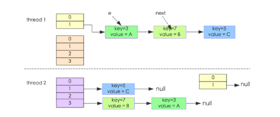
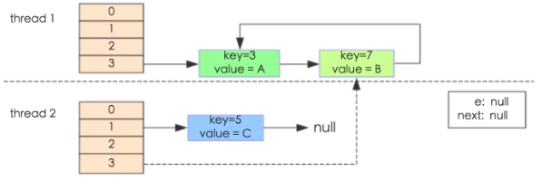

# Map集合类的简单介绍
---

## 1. 公共概念

### 1.1 下标计算

**segments**： 数组集合
**segmentMask**: 掩码 ($2^n-1$),对应 1111...1个1的集合
**segementShift**: 32 - n ,用于计算位偏移

计算逻辑：
```java
// hash
static final int spread(int h) {
    return (h ^ (h >>> 16)) & HASH_BITS;
}

// 计算高n位对应的segment index
int index = (hash >>> segmentShift) & segmentMask;

// table
segment = segments[index];

```

### 1.2 tableSizeFor方法 

计算略大于cap的数$2^n$

```java
private static final int tableSizeFor(int c) {
    // c 可能为 $2^n$, 减一变成11111，尽可能多1
    int n = c - 1;
    // 任何数二进制最高位一定为1，所以>>>1一定为0 进行计算
    // 100.000
    // 010.000
    //--------
    // 110.000
    // 得到最高2位都是1
    n |= n >>> 1;
    // 同理最高4位都是1
    n |= n >>> 2;
    n |= n >>> 4;
    n |= n >>> 8;
    // 最大32位，到此可以结束
    n |= n >>> 16;
    return (n < 0) ? 1 : (n >= MAXIMUM_CAPACITY) ? MAXIMUM_CAPACITY : n + 1;
}
```


### 1.3 扩容理解

### 1.3.1 为什么数组的长度是 $2^n$

计算数组下标的方式为（len-1)&hash

在len为 $2^n$的情况下，（len-1)&hash == hash % len ,原因如下：
len-1 的二进制表示为： 1...111 (n-1个1)，与hash进行 ``&`` 运算是，会把 n位之前的1都给过滤掉，计算如下：
```

hash    1001101...1
& len-1     111...1
---------------------
            101...1

```
对于位来说，将n扩大两倍的方式是将位向右移动1位。
而 hash % len 等于将 1001101...1 将 ``1001``101...1这四位给省略掉，因为他们可定是 ``len`` 的整数倍,等于将n位移除得到余数


另外就是根据位运算： 1&0=0，1&1=1 有两种结果。 0&1=0，0&0=0 有一种结果。
由hash位置的计算 （len-1)&hash，当一方存在较多的1时，可以增加结果集的数量，让结果多了些可能性

所以当 len 为 $2^n$时，len-1 为 111...1

### 1.3.2 扩容为什么是原来的2倍

如上所属，为了保持数组长度是 $2^n$

### 1.3.3 扩容时把原列表拆分成（i, i+oldCap)两个

**i:** 指的是原数据所在的数组下标

扩容前为：  1111....1
扩容后为： 11111....1

根据最高位的1与hash的 `&` 只有0 和1 两种结果，所以新生成的hash的下标为 oldIndex 和 oldCap + oldIndex （因为扩容为原来的2倍，所以新增的最高位1所代表的数字为 $2^n$)


## 2. Hashmap

### 2.1 HashMap为什么是非线性安全的
当存在多个线程同时操作map时，可能会出现死循环异常。参考[重新认识Hashmap](http://www.importnew.com/20386.html#comment-536483)
```java
    // 在jdk7中当map进行数据扩容时，代码如下：
    public void transfer(Entry[] newTable) {
        Entry[] src = table;                   //src引用了旧的Entry数组
        int newCapacity = newTable.length;
        for (int j = 0; j < src.length; j++) { //遍历旧的Entry数组
            Entry<K,V> e = src[j];             //取得旧Entry数组的每个元素
            if (e != null) {
                src[j] = null;//释放旧Entry数组的对象引用（for循环后，旧的Entry数组不再引用任何对象）
                do {
                    Entry<K,V> next = e.next;
                    int i = indexFor(e.hash, newCapacity); //！！重新计算每个元素在数组中的位置
                    e.next = newTable[i]; //标记[1                newTable[i] = e;      //将元素放在数组上
                    e = next;             //访问下一个Entry链上的元素
                } while (e != null);
            }
        }
    }
    
    //测试代码
    public class HashMapInfiniteLoop {  
        private static HashMap<Integer,String> map = new HashMap<Integer,String>(2，0.75f);  
        public static void main(String[] args) {  
            map.put(5， "C");  
     
            new Thread("Thread1") {  
                public void run() {  
                    map.put(7, "B");  
                    System.out.println(map);  
                };  
            }.start();  
            new Thread("Thread2") {  
                public void run() {  
                    map.put(3, "A);  
                    System.out.println(map);  
                };  
            }.start();        
        }  
    }
```

问题分析：

- 当thread1，thread2执行到transfer->Entry<K,V> next = e.next时，断住threa1,让thread2执行，此时的初始情况如下图所示，对于thread1,thread2来说,执行完之后的当前map的数据分配

<div align=center>



*扩容前*
</div>

- 在thread1的断点处,当前的thread1的状态为e = key(3), next = key(7),指向的是线程二重组后的链表（即key7.next = key3,key3.next=null)； 线程1被调度回来之后,e.next= newTable[i]导致key3.next=key7,，执行newTable[i]= e,然后e = next,导致e指向了key(7),下一次的循环会导致e执行key(3)(因为thread2执行完后的数据状态是key(7)指向key3), 这样就形成一个循环

<div align=center>


</div>

- 执行的伪过程 
```java
    {
        //伪代码，thread2执行完后,针对于thread1的执行流程
        e = key(3), next = key(7), key(3).next = null, key(7).next = key(3)
        e.next = newTable[i]    // key(3).next = key(7),key3指向了newTable[i]的第一个节点，即key(7)
        newTable[i] = e        //newTable[i]的第一个点执行了key(3)
        e = next              //e = key(7)

        do //下一个循环开始
        next = e.next // 使next = key(7).next = key(3),而由第二行知道key(3).next = key(7),因此一个inflit cycle开始了
        ...
    }
```


## 4 参考链接

1. [jdk8 HashMap源码解读](https://blog.csdn.net/qq_29031555/article/details/105123462?spm=1001.2014.3001.5502)

2. https://blog.csdn.net/keepfriend/article/details/113346166
3. https://xie.infoq.cn/article/901e4fa89353a6dfb63490c3d 