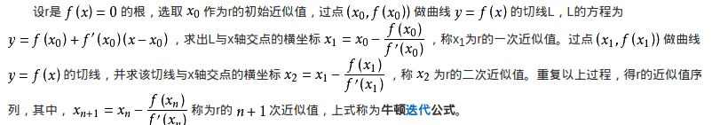

# 数据公式解决问题

## 一些基本公式

## 根据数据公式计算的代码
1. 用牛顿迭代法求平方根
<div align="center">


</div>

```
我们一般初次猜测X=1,然后不断的通过迭代堆数据进行推进,逐步告警精确值,
首先更具我们最开始求2次方根的公式,另x^2 = n,
假设一个关于X的函数位f(x) - f(X) = X^2 - n (领这个方程的f(X)尽可能的趋近0,X就是解)
求f(X)的一阶导为:
f'(X) = 2X
代入前面求到的最终式中:
Xk+1 = Xk - (Xk2 - n)/2Xk
化简即得到我们最初提到的那个求平方根的神奇公式了:
x_(k+1)=1/2(x_k+n/(x_k))
例如，可以用这样方式去计算2的平方根。
|猜想|    商|  平均值|
|:------|:------|:---|
1    2/1=2    (2+1)/2 = 1.5
1.5  2/1.5=1.3333     (1.3333+1.5)/2 = 1.4167
1.4167   2/1.4167=1.4118      (1.4167+1.4118)/2=1.4142
1.4142        ...          ...
//code
double sqr(double n) { 
    double k=1.0; 
    while(abs(k*k-n)>1e-9) { 
        k=(k+n/k)/2; 
    } 
    return k; 
}
```
