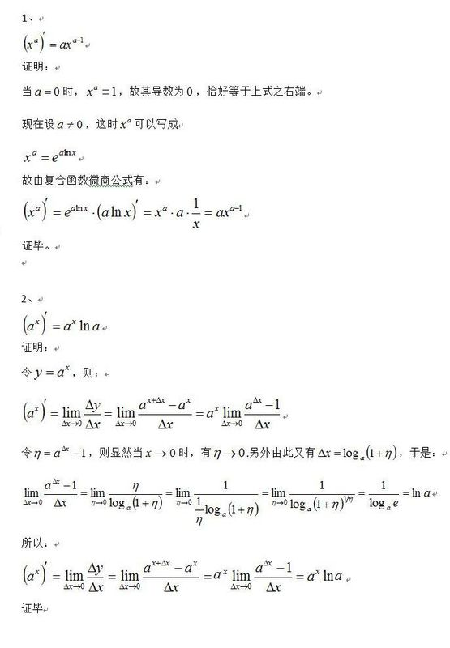

# 高数学习


### 倒数求解

- lnx的导数
```
设y=lnx
e^y=x
两边分别求导
e^y*y'=1
y'=1/e^y=e^(-y)=e^(-lnx)=e^ln(1/x)=1/x
```     

- a^x的导数
 ```
a=e^lna
y=a^x=(e^(lna))^x=(e^x)^lna
以上复合函数求导y‘=lna*(e^x)^(lna-1)*e^x=lna*(e^x)^lna=lna*(e^lna)^x=lna*a^x
y=a^x的导数为y’=lna*a^x可以当做公式记忆,以上是推导过程.
 ```

