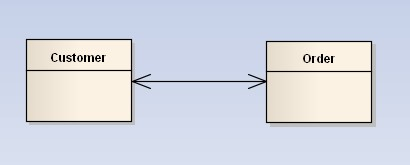
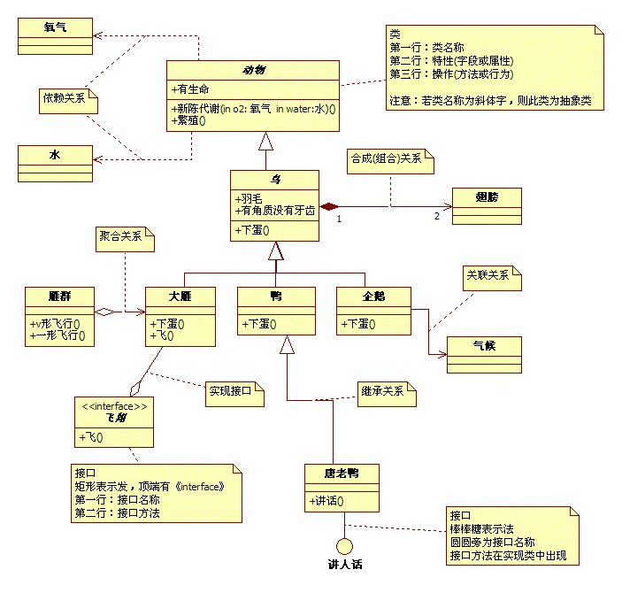

# UML 基本知识

###UML 基本知识

#### 1. UML类图的几种基本的表示
- 泛化(generalization):表示is-a的关系，是对象之间耦合度最大的一种关系，子类继承父类的所有细节。直接使用语言中的继承表达。在类图中使用带三角箭头的实线表示，箭头从子类指向父类   

- 实现（Realization）:在类图中就是接口和实现的关系,在类图中使用带三角箭头的虚线表示，箭头从实现类指向接口

- 依赖(Dependency)：对象之间最弱的一种关联方式，是临时性的关联。代码中一般指由局部变量、函数参数、返回值建立的对于其他对象的调用关系。一个类调用被依赖类中的某些方法而得以完成这个类的一些职责。在类图使用带箭头的虚线表示，箭头从使用类指向被依赖的类

- 关联(Association) : 对象之间一种引用关系，比如客户类与订单类之间的关系。这种关系通常使用类的属性表达。关联又分为一般关联、聚合关联与组合关联。后两种在后面分析。在类图使用带箭头的实线表示，箭头从使用类指向被关联的类。可以是单向和双向

- 聚合(Aggregation) : 表示has-a的关系，是一种不稳定的包含关系。较强于一般关联,有整体与局部的关系,并且没有了整体,局部也可单独存在。如公司和员工的关系，公司包含员工，但如果公司倒闭，员工依然可以换公司。在类图使用空心的菱形表示，菱形从局部指向整体

- 组合(Composition) : 表示contains-a的关系，是一种强烈的包含关系。组合类负责被组合类的生命周期。是一种更强的聚合关系。部分不能脱离整体存在。如公司和部门的关系，没有了公司，部门也不能存在了；调查问卷中问题和选项的关系；订单和订单选项的关系。在类图使用实心的菱形表示，菱形从局部指向整体    

- 多重性(Multiplicity) : 通常在关联、聚合、组合中使用。就是代表有多少个关联对象存在。使用数字..星号（数字）表示。如下图，一个割接通知可以关联0个到N个故障单。

#### 2. 聚合和组合的区别
聚合关系是“has-a”关系，组合关系是“contains-a”关系；聚合关系表示整体与部分的关系比较弱，而组合比较强；聚合关系中代表部分事物的对象与代表聚合事物的对象的生存期无关，一旦删除了聚合对象不一定就删除了代表部分事物的对象。组合中一旦删除了组合对象，同时也就删除了代表部分事物的对象 

### UML的一个类图实例
类图实例：

**UML中类图实例**
接口：空心圆+直线（唐老鸭类实现了‘讲人话’）；
依赖：虚线+箭头（动物和空气的关系）；
关联：实线+箭头（企鹅需要知道气候才迁移）；
聚合：空心四边形+实线+箭头（雁群和大雁的关系）；
合成/组合：实心四边形+实线+箭头（鸟和翅膀的关系）；
泛化/继承：空心三角形+实线（动物和鸟的继承关系）；
实现：空心三角形+虚线（实现大雁飞翔的接口）

参考链接：[uml类图与类关系详解](http://www.uml.org.cn/oobject/201104212.asp)
