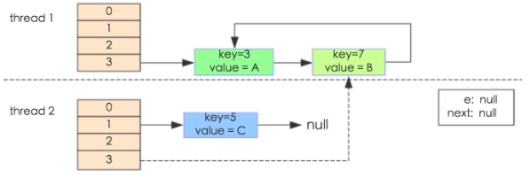

# Map集合类的简单介绍
---
## Hashmap

##### **HashMap为什么是非线性安全的**
当存在多个线程同时操作map时，可能会出现死循环异常。参考[重新认识Hashmap](http://www.importnew.com/20386.html#comment-536483)
```java
    // 在jdk7中当map进行数据扩容时，代码如下：
    public void transfer(Entry[] newTable) {
        Entry[] src = table;                   //src引用了旧的Entry数组
        int newCapacity = newTable.length;
        for (int j = 0; j < src.length; j++) { //遍历旧的Entry数组
            Entry<K,V> e = src[j];             //取得旧Entry数组的每个元素
            if (e != null) {
                src[j] = null;//释放旧Entry数组的对象引用（for循环后，旧的Entry数组不再引用任何对象）
                do {
                    Entry<K,V> next = e.next;
                    int i = indexFor(e.hash, newCapacity); //！！重新计算每个元素在数组中的位置
                    e.next = newTable[i]; //标记[1                newTable[i] = e;      //将元素放在数组上
                    e = next;             //访问下一个Entry链上的元素
                } while (e != null);
            }
        }
    }
    
    //测试代码
    public class HashMapInfiniteLoop {  
        private static HashMap<Integer,String> map = new HashMap<Integer,String>(2，0.75f);  
        public static void main(String[] args) {  
            map.put(5， "C");  
     
            new Thread("Thread1") {  
                public void run() {  
                    map.put(7, "B");  
                    System.out.println(map);  
                };  
            }.start();  
            new Thread("Thread2") {  
                public void run() {  
                    map.put(3, "A);  
                    System.out.println(map);  
                };  
            }.start();        
        }  
    }
```

问题分析：

- 当thread1，thread2执行到transfer->Entry<K,V> next = e.next时，断住threa1,让thread2执行，此时的初始情况如下图所示，对于thread1,thread2来说,执行完之后的当前map的数据分配

<div align=center>

*扩容前*
</div>

- 在thread1的断点处,当前的thread1的状态为e = key(3), next = key(7),指向的是线程二重组后的链表（即key7.next = key3,key3.next=null)； 线程1被调度回来之后,e.next= newTable[i]导致key3.next=key7,，执行newTable[i]= e,然后e = next,导致e指向了key(7),下一次的循环会导致e执行key(3)(因为thread2执行完后的数据状态是key(7)指向key3), 这样就形成一个循环

<div align=center>

</div>

- 执行的伪过程 
```
    {
        //伪代码，thread2执行完后,针对于thread1的执行流程
        e = key(3), next = key(7), key(3).next = null, key(7).next = key(3)
        e.next = newTable[i]    // key(3).next = key(7),key3指向了newTable[i]的第一个节点，即key(7)
        newTable[i] = e        //newTable[i]的第一个点执行了key(3)
        e = next              //e = key(7)

        do //下一个循环开始
        next = e.next // 使next = key(7).next = key(3),而由第二行知道key(3).next = key(7),因此一个inflit cycle开始了
        ...
    }
```
