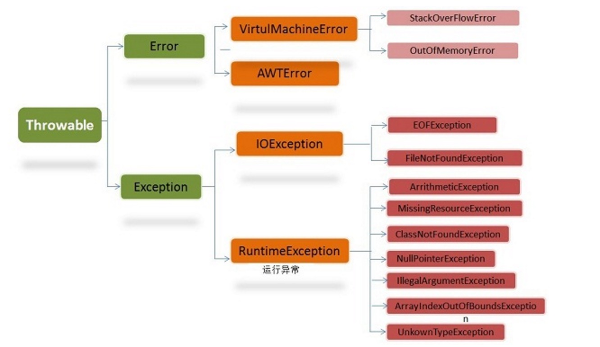

# 异常的基础

在java中，异常的继承结构如下：

<table width="1000"><tr><td bgcolor=#7FFFD4 width="700">

</td></tr></table>

## 1. checked 和 unchecked 异常

在java中，将派生于Error或者RuntimeException（比如空指针，1/0）的异常称为unchecked异常，其他继承自java.lang.Exception得异常统称为Checked Exception，如IOException、TimeoutException等

**checked exception（检查异常，编译异常)**

 也称非运行时异常（运行时异常以外的异常就是非运行时异常），不是程序中可以预测的。比如无效的用户输入，文件不存在，网络或者数据库链接错误(常见的IOExeption和SQLException)。这些都是外在的原因，都不是程序内部可以控制的。java编译器强制程序员必须进行捕获处理(比如try-catch处理块或者添加throws说明)，对于非运行时异常如果不进行捕获或者抛出声明处理，编译都不会通过
 
**unchecked exception（非检查异常)**

 也称运行时异常（RuntimeException），表示错误，程序的逻辑错误。是RuntimeException,Error的子类，比如常见的NullPointerException、IndexOutOfBoundsException。对于运行时异常，java编译器不要求必须进行异常捕获处理或者抛出声明，由程序员自行决定。

> 如果在使用spring 的 Transactional 进行事务处理时，默认情况下会对unchecked异常进行回滚，而对checked异常则不会进行回滚， 因此如果在事务中有外部依赖，要查看该外部依赖的异常调用栈，防止出现有异常但没回滚的情况。
