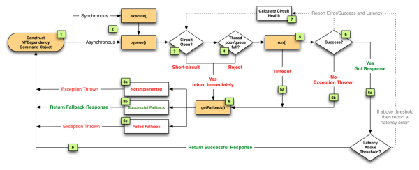

# Hystrix 总结

## 1. 背景
随着业务复杂度的增加，依赖的服务也逐步增加. 在高并发访问下,这些依赖的稳定性与否对系统的影响非常大,但是依赖有很多不可控问题:如网络连接缓慢，资源繁忙，暂时不可用，服务脱机等在分布式,系统中经常会出现某个基础服务不可用进而造成整个系统不可用的情况，高并发的依赖失败时如果没有隔离措施，当前应用服务就有被拖垮的风险。

为应对这些情况，必要的安全处理不可缺少。Netflix 开源的 Hystrix框架 帮我们大大简化了超时机制和断路器的实现


## 2. 常见的服务异常
1）系统依赖的某个服务发生延迟或者故障，数秒内导致所有应用资源（线程，队列等）被耗尽，造成所谓的雪崩效应 (Cascading Failure)，导致整个系统拒绝对外提供服务。(服务雪崩是一种因服务提供者的不可用导致服务调用者的不可用，并将不可用逐渐放大的过程)

2）系统遭受恶意爬虫袭击，在放大效应下没有对下游依赖服务做好限速处理，最终导致下游服务崩溃


## 3. Hystrix 提供的3中方案
（1）**熔断模式(CircuitBreaker)**：这种模式主要是参考电路熔断，如果一条线路电压过高，保险丝会熔断，防止火灾。放到我们的系统中，如果某个目标服务调用慢或者有大量超时，此时，熔断该服务的调用，对于后续调用请求，不在继续调用目标服务，直接返回，快速释放资源。如果目标服务情况好转则恢复调用。


（2）**隔离模式（Bulkheads舱壁隔离模式）**：这种模式就像对系统请求按类型划分成一个个小岛的一样，当某个小岛被火烧光了，不会影响到其他的小岛。例如可以对不同类型的请求使用线程池来资源隔离，每种类型的请求互不影响，如果一种类型的请求线程资源耗尽，则对后续的该类型请求直接返回，不再调用后续资源。这种模式使用场景非常多，例如将一个服务拆开，对于重要的服务使用单独服务器来部署。

- 线程池隔离模式：使用一个线程池来存储当前的请求，线程池对请求作处理，设置任务返回处理超时时间，堆积的请求堆积入线程池队列。这种方式需要为每个依赖的服务申请线程池，有一定的资源消耗，好处是可以应对突发流量（流量洪峰来临时，处理不完可将数据存储到线程池队里慢慢处理）。
```
hystrix的隔离级别
HystrixCommandGroupKey：这个的名称设置为一个被调用的服务，eg.hotelService，所有这个服务下的方法都用同一个线程池（前提是没有配置ThreadPoolKey）
HystrixCommandKey：这个名称通常是被调用服务的一个方法的名字（实际上就是被调用服务某一个controller中的一个对外方法），eg.getHotelInfo()
ThreadPoolKey：这个用的很少，除非一个被调用服务中的有些被调用方法快、有的被调用方法慢，这样的话，就需要分别使用一个ThreadPoolKey，为每一个方法单独分配线程池
```

- 信号量隔离模式：使用一个原子计数器（或信号量）来记录当前有多少个线程在运行，请求来先判断计数器的数值，若超过设置的最大线程个数则丢弃改类型的新请求，若不超过则执行计数操作请求来计数器+1，请求返回计数器-1。这种方式是严格的控制线程且立即返回模式，无法应对突发流量（流量洪峰来临时，处理的线程超过数量，其他的请求会直接返回，不继续去请求依赖的服务）

（3）**限流模式**：上述的熔断模式和隔离模式都属于出错后的容错处理机制，而限流模式则可以称为预防模式。限流模式主要是提前对各个类型的请求设置最高的QPS阈值，若高于设置的阈值则对该请求直接返回，不再调用后续资源。这种模式不能解决服务依赖的问题，只能解决系统整体资源分配问题，因为没有被限流的请求依然有可能造成雪崩效应。


## 4. Hystrix的实现流程



图中流程的说明:

- 将远程服务调用逻辑封装进一个HystrixCommand。
- 对于每次服务调用可以使用同步或异步机制，对应执行execute()或queue()。
- 判断熔断器(circuit-breaker)是否打开或者半打开状态，如果打开跳到步骤8，进行回退策略，如果关闭进入步骤4。
- 判断线程池/队列/信号量（使用了舱壁隔离模式）是否跑满，如果跑满进入回退步骤8，否则继续后续步骤5。
- run方法中执行了实际的服务调用。
    * 服务调用发生超时时，进入步骤8。
- 判断run方法中的代码是否执行成功。
    - a. 执行成功返回结果。
    - b. 执行中出现错误则进入步骤8。
- 所有的运行状态(成功，失败，拒绝，超时)上报给熔断器，用于统计从而影响熔断器状态。
- 进入getFallback()回退逻辑。
    - a. 没有实现getFallback()回退逻辑的调用将直接抛出异常。
    - b. 回退逻辑调用成功直接返回。
    - c. 回退逻辑调用失败抛出异常。
- 返回执行成功结果

参考：[美团点评技术团队](https://zhuanlan.zhihu.com/p/23711137)


