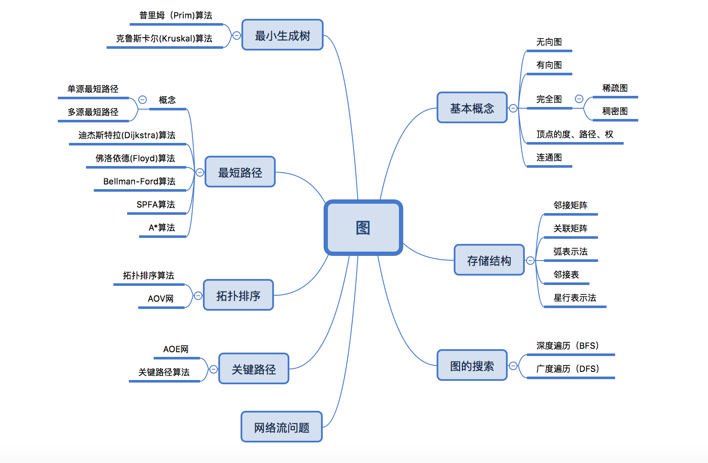
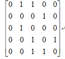
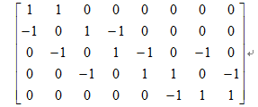
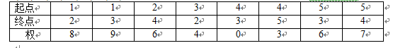
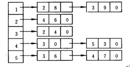
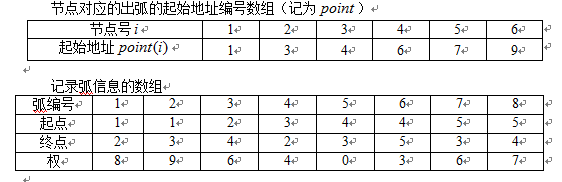

.. highlight:: rst

图
------

图的定义
=========

1 无向图
  如果图中任意两个顶点之间的边都是无向边（简而言之就是没有方向的边），则称该图为无向图

2 有向图
  如果图中任意两个顶点之间的边都是有向边，则称该图为有向图（Directed graphs）

3 完全图
  如果任意两个顶点之间都存在边，则称该图为完全图，
  根据边的方向属性又分为有向完全图(即含有n个顶点的完全图有n(n-1)条边,两个方向各一条边)和无向完全图(即含有n个顶点的完全图有n(n-1)/2条边),

  当一个图接近完全图时，我们称之为稠密图(Dense Graph),当一个图含有较少的边时，称之为稀疏图（Spare Graph)

4 顶点的度、路径、权
  顶点的度是指图中与点相关的边的条数，在有向图中又分为出度和入度
  路径 从点vi出发有一组边w1，w2,w3...wn是的（wi,wi+1) 属于 E，这样的顶点序列称为路径

5. 连通图
   在一个无向图中从每个顶点到其他顶点都有一条路径，那么该无向图称为连通图
   具备这样性质的有向图称为强连通图

图的存储结构
==============
    .. image:: ../../image/graph/graph.png

矩阵表示法
::::::::::::

  |graph01| 

  如果两节点之间有一条弧，则邻接矩阵中对应的元素为1；否则为0
  在有向图中，行中1的个数代表该顶点的出度，列中1的个数代表该顶点的入度

关联矩阵表示法
::::::::::::::
    
    |graph02|
  
  在关联矩阵中，每行对应于图的一个节点，每列对应于图的一条弧。如果一个节点是一条弧的起点，则关联矩阵中对应的元素为1；如果一个节点是一条弧的终点，则关联矩阵中对应的元素为 -1；如果一个节点与一条弧不关联，则关联矩阵中对应的元素为0。对于简单图，关联矩阵每列只含有两个非零元（一个 1，一个-1）可以看出，这种表示法也非常简单、直接。但是，在关联矩阵的所有mn 个元素中，只有 2m个为非零元。如果网络比较稀疏，这种表示法也会浪费大量的存储空间。但由于关联矩阵有许多特别重要的理论性质，因此它在网络优化中是非常重要的概念
  对于网络中的权，也可以通过对关联矩阵的扩展来表示。例如，如果网络中每条弧有一个权，我们可以把关联矩阵增加一行，把每一条弧所对应的权存储在增加的行中。如果网络中每条弧赋有多个权，我们可以把关联矩阵增加相应的行数，把每一条弧所对应的权存储在增加的行中。

弧表示法
:::::::::::::
    |graph03|

    为了便于检索，一般按照起点、终点的字典序顺序存储弧表，如上面的弧表就是按照这样的顺序存储的

邻接表表示法
::::::::::::

    |graph04|

    邻接表表示法将图以邻接表（adjacency  lists）的形式存储在计算机中。所谓图的邻接表，也就是图的所有节点的邻接表的集合；而对每个节点，它的邻接表就是它的所有出弧。邻接表表示法就是对图的每个节点，用一个单向链表列出从该节点出发的所有弧，链表中每个单元对应于一条出弧。为了记录弧上的权，链表中每个单元除列出弧的另一个端点外，还可以包含弧上的权等作为数据域。图的整个邻接表可以用一个指针数组表示

星行表示法
::::::::::::

    |graph05|

    星形（star）表示法的思想与邻接表表示法的思想有一定的相似之处。对每个节点，它也是记录从该节点出发的所有弧，但它不是采用单向链表而是采用一个单一的数组表示。也就是说，在该数组中首先存放从节点1出发的所有弧，然后接着存放从节点2出发的所有孤，依此类推，最后存放从节点 出发的所有孤。对每条弧，要依次存放其起点、终点、权的数值等有关信息。这实际上相当于对所有弧给出了一个顺序和编号，只是从同一节点出发的弧的顺序可以任意排列。此外，为了能够快速检索从每个节点出发的所有弧，我们一般还用一个数组记录每个节点出发的弧的起始地址（即弧的编号）。在这种表示法中，可以快速检索从每个节点出发的所有弧，这种星形表示法称为前向星形（forward star）表示法

    
图的搜索
==========

从图中某一个顶点出发遍历途中其余顶点，每一个顶点仅被访问一次

深度遍历
:::::::::::

  

广度遍历
:::::::::::

基本步骤：
  1. 先入队列一个元素
  2. 弹出队列顶端的1个元素打印，并把它连接的顶点入队
  3. 重复以上过程，直到队列为空

最小生成树
===============

概念
:::::::

一个带权值的图：网。所谓最小成本，就是用n-1条边把n个顶点连接起来，且连接起来的权值最小,我们把构成联通网的最小代价的生成树叫做最小生成树

例如：要在n个城市之间铺设光缆，主要目标是要使这 n 个城市的任意两个之间都可以通信，但铺设光缆的费用很高，且各个城市之间铺设光缆的费用不同，因此另一个目标是要使铺设光缆的总费用最低。这就需要找到带权的最小生成树

算法实现
:::::::::

针对于图G，从空树T开始，往集合中添加n-1条边(u,v),最终生成一棵含有n-1条标的MST树

Prim算法
''''''''''''''

::

    1. 输入：一个加权连通图，其中顶点集合为V，边集合为E；
    2.初始化：Vnew= {x}，其中x为集合V中的任一节点（起始点），Enew= {},为空；
    3.重复下列操作，直到Vnew= V：
        a.在集合E中选取权值最小的边<u, v>，其中u为集合Vnew中的元素，而v不在Vnew集合当中，
          并且v∈V（如果存在有多条满足前述条件即具有相同权值的边，则可任意选取其中之一）；
        b.将v加入集合Vnew中，将<u, v>边加入集合Enew中；
    4.输出：使用集合Vnew和Enew来描述所得到的最小生成树

Kruskal算法
'''''''''''

  算法从边的集合中挑选权值最小的，加入到选择的边集合中。如果这条边，予以选择的边构成了回路，则舍弃这条边

  先构造一个只含 n 个顶点，而边集为空的子图，若将该子图中各个顶点看成是各棵树上的根结点，则它是一个含有 n 棵树的一个森林。之后，从网的边集 E 中选取一条权值最小的边，若该条边的两个顶点分属不同的树，则将其加入子图，也就是说，将这两个顶点分别所在的两棵树合成一棵树；反之，若该条边的两个顶点已落在同一棵树上，则不可取，而应该取下一条权值最小的边再试之。依次类推，直至森林中只有一棵树，也即子图中含有 n-1条边为止

最短路径
==========

从图中某一顶点到另一顶点的路径可能不止一条，如何找出一条路径使得该路径上各边的权值之和最小

单源最短路径：从一个点到所有其他点的最短路径，得到的结果是一个数组，表示某个点到其他点的最短距离
多源最短路径：计算所有点到其他点的最短距离，得到的是一个矩阵。常用的算法有Floyd算法

算法描述
:::::::::::::::

松弛操作
'''''''''

    是指对于每个顶点v∈V，都设置一个属性d[v]，用来描述从源点s到v的最短路径上权值的上界，称为最短路径估计
    在松弛一条边(u,v)的过程中，要测试是否可以通过u，对迄今找到的v的最短路径进行改进；如果可以改进的话，则更新d[v]和π[v]。一次松弛操作可以减小最短路径估计的值d[v]，并更新v的前趋域π[v](S到v的当前最短路径中v点之前的一个点的编号

Dijkstra算法
'''''''''''''''

时间复杂度：O(n^2)

权值为正的有向图,贪心算法策略

具体步骤:

    1、选一顶点v为源点，并视从源点v出发的所有边为到各顶点的最短路径（确定数据结构：因为求的是最短路径，所以①就要用一个记录从源点v到其它各顶点的路径长度数组dist[],开始时，dist是源点v到顶点i的直接边长度，即dist中记录的是邻接阵的第v行。②设一个用来记录从源点到其它顶点的路径数组path[],path中存放路径上第i个顶点的前驱顶点）。
    2、在上述的最短路径dist[]中选一条最短的，并将其终点（即<v,k>）k加入到集合s中。
    3、调整T中各顶点到源点v的最短路径。 因为当顶点k加入到集合s中后，源点v到T中剩余的其它顶点j就又增加了经过顶点k到达j的路径,这条路径可能要比源点v到j原来的最短的还要短。调整方法是比较dist[k]+g[k,j]与dist[j]，取其中的较小者。
    4、再选出一个到源点v路径长度最小的顶点k,从T中删去后加入S中，再回去到第三步，如此重复，直到集合S中的包含图G的所有顶点

.. code-block::

    Dijkstra(G,w,s)
    for each vertex v in G.V
        v.d=FIN;   //最短路径估计
        v.π=NIL； //前驱节点        
    s.d=0;   //到源节点距离为0
    S=NULL;
    Q=G.V;
    while !Q.empty
        u=EXTRACT-MIN(Q)   //最小优先队列
        S=SU{u}
        for each vertex v in G.Adj[u]
           RELAX(u,v,w)

    RELAX(u,v,w)     //松弛操作，更新距离
        if v.d>u.d+w(u,v)    
            v.d=u.d+w(u,v)    
            v.π=u

佛洛依德(Floyd)算法
'''''''''''''''''''''''''

时间复杂度：O(n^3)
空间复杂度: O(n^2)

动态规划策略

.. code-block:: java

    //只能从k中转
    for(k=1; k<=cityCount; k++){
        //从i出发
        for(i=1; i<=cityCount; i++){
            //到j结束
            for(j=1; j<=cityCount; j++){
                if(map[i][j] > (map[i][k] + map[k][j])){
                    map[i][j] = map[i][k]+ map[k][j];
                }
            }
        }
    }

为什么中转层K要在最外层

::

    因为假如k在最里层,那么d[i][j]=min(d[i][j],d[i][k]+d[k][j])是一次性执行完.
    那么我们就要保证,在这时候,至少存在一个k=x,使得d[i][x]和d[x][j]都是取得了最小值.
    而要保证d[i][x]取得了最小值，那么一定是要遍历过比x还小的值来更新d[i][x]
    因此如果k在最里层，那么比k小的情况并没有先一步提前全部遍历（因为是随着i，j变化的） ,这种情况下我们并不能保证,但如果k在最外层就可以保证了.

Bellman-Ford算法
'''''''''''''''''''''

Dijkstra 只能用于正权边,而Bellman可以用于负权边

算法描述

    1. 创建源顶点 v 到图中所有顶点的距离的集合 distSet，为图中的所有顶点指定一个距离值，初始均为 Infinite，源顶点距离为 0；
    2. 计算最短路径，执行 V - 1 次遍历；
        对于图中的每条边：如果起点 u 的距离 d 加上边的权值 w 小于终点 v 的距离 d，则更新终点 v 的距离值 d；
    3. 检测图中是否有负权边形成了环，遍历图中的所有边，计算 u 至 v 的距离，如果对于 v 存在更小的距离，则说明存在环；

.. code-block::

    BELLMAN-FORD(G, w, s)
      INITIALIZE-SINGLE-SOURCE(G, s)
      for i  1 to |V[G]| - 1
           do for each edge (u, v)  E[G]
                do RELAX(u, v, w)
      for each edge (u, v)  E[G]
           do if d[v] > d[u] + w(u, v)
                then return FALSE
      return TRUE

SPFA算法
'''''''''''

在 Bellman-ford 算法的基础上加上一个队列优化，减少了冗余的松弛操作，是一种高效的最短路算法。

算法过程：
  设立一个队列用来保存待优化的顶点，优化时每次取出队首顶点 u，并且用 u 点当前的最短路径估计值dis[u]对与 u 点邻接的顶点 v 进行松弛操作，如果 v 点的最短路径估计值dis[v]可以更小，且 v 点不在当前的队列中，就将 v 点放入队尾。这样不断从队列中取出顶点来进行松弛操作，直至队列空为止

检测负权回路

     方法：如果某个点进入队列的次数大于等于 n，则存在负权回路，其中 n 为图的顶点数

A*算法
'''''''''''

// TODO 

算法对比
::::::::::

+----------------------+----------------------+----------------------+--------------------+--------------------+
| NONE                 | floyd                | Dijkstra             | bellman-ford       | SPFA               |
+======================+======================+======================+====================+====================+
| 空间复杂度           | O(N²)                | O(M)                 | O(M)               | O(M)               |
+----------------------+----------------------+----------------------+--------------------+--------------------+
| 时间复杂度           | O(N³)                | O((m+n)logN)         | O(MN)              | 最坏也是O(NM)      |
+----------------------+----------------------+----------------------+--------------------+--------------------+
| 适用情况             | 稠密图和顶点关系密切 | 稠密图和顶点关系密切 | 稀疏图和边关系密切 | 稀疏图和边关系密切 |
+----------------------+----------------------+----------------------+--------------------+--------------------+
| 负权                 | 可以                 | 不能                 | 可以               | 可以               |
+----------------------+----------------------+----------------------+--------------------+--------------------+
| 有负权边时可否处理   | 可以                 | 不能                 | 可以               | 可以               |
+----------------------+----------------------+----------------------+--------------------+--------------------+
| 判断是否存在负权回路 | 不能                 | 不能                 | 可以               | 可以               |
+----------------------+----------------------+----------------------+--------------------+--------------------+

Table： N表示点数，M表示边数

1. DJ算法和下面的Floyd算法是基于邻接矩阵的，而Bellman-Ford算法是基于邻接表，从边的角度考量的。

2. Bellman-Ford 算法和 Dijkstra 算法同为解决单源最短路径的算法。对于带权有向图 G = (V, E)，Dijkstra 算法要求图 G 中边的权值均为非负，而 Bellman-Ford 算法能适应一般的情况（即存在负权边的情况）。一个实现的很好的 Dijkstra 算法比 Bellman-Ford 算法的运行时间要低

3. Bellman-Ford 算法采用动态规划（Dynamic Programming）进行设计，实现的时间复杂度为 O(V*E)，其中 V 为顶点数量，E 为边的数量。Dijkstra 算法采用贪心算法（Greedy Algorithm）范式进行设计，普通实现的时间复杂度为 O(V2)，若基于 Fibonacci heap 的最小优先队列实现版本则时间复杂度为 O(E + VlogV)

拓扑排序
============

定义: 对于任何有向图而言，其拓扑排序为其所有结点的一个线性排序（对于同一个有向图而言可能存在多个这样的结点排序）。该排序满足这样的条件——对于图中的任意两个结点u和v，若存在一条有向边从u指向v，则在拓扑排序中u一定出现在v前面。

AOV网： 在一个表示工程的有向图中，有顶点表示活动，用弧表示活动之间的优先关系，这样的有向图为顶点表示活动的网

步骤:
    1. 在有向图中选一个没有前驱(即入度为0的点)的顶点并且输出
    2. 从图中删除该顶点和所有以次顶点为尾的弧，即删除所有与它有关的边。
    3. 重复上述两步，直至全部顶点均已输出；或者当图中不存在无前驱的顶点为止。

关键路径
========

AOE网: 在带权的有向图中，以 ``顶点`` 表示事件，以 ``有向边`` 表示活动，边上的权值表示活动的开销（如该活动持续的时间）

- 事件的最早发生时间ve[k]: ve[k]是指从始点开始到顶点vk的最大路径长度。这个长度决定了所有从顶点vk发出的活动能够开工的最早时间

::

    ve[1] = 0
    ve[k] = max{ve[j]+len<vj,vk>r}(<vj,vk> 属于P)

- 事件的最迟发生时间vl[k]: vl[k]是指在不推迟整个工期的前提下,事件vk允许的最晚发生时间。

::

    vl[n] = ve[n] 
    vl[k] = max{vl[j]-len<vk,vj>r}(<vj,vk> 属于P)

- 活动的最早开始时间e[i]: 活动ai是由弧<vk , vj>表示，则活动ai的最早开始时间应等于事件vk的最早发生时间。因此，有：e[i]=ve[k]

- 活动的最晚开始时间l[i]: 活动ai的最晚开始时间是指，在不推迟整个工期的前提下， ai必须开始的最晚时间。若ai由弧<vk，vj>表示，则ai的最晚开始时间要保证事件vj的最迟发生时间不拖后。因此，有：l[i]=vl[j]-len<vk, vj>

``算法步骤``

    准备两个数组，a：最早开始时间数组etv，b：最迟开始时间数组。（针对顶点即事件而言）

    1.从源点V0出发，令etv[0]（源点）=0，按拓扑有序求其余各顶点的最早发生时间etv[i]（1 ≤ i ≤ n-1）。同时按照上一章

    拓扑排序的方法检测是否有环存在。

    2.从汇点Vn出发，令ltv[n-1] = etv[n-1]，按拓扑排序求各个其余各顶点的最迟发生时间ltv[i]（n-2 ≥ i ≥ 2）;

    3.根据各顶点的etv和ltv数组的值，求出弧（活动）的最早开工时间和最迟开工时间，求每条弧的最早开工时间和最迟开工时间是否相等，若相等，则是关键活动。

网络流问题
=============

// TODO 

