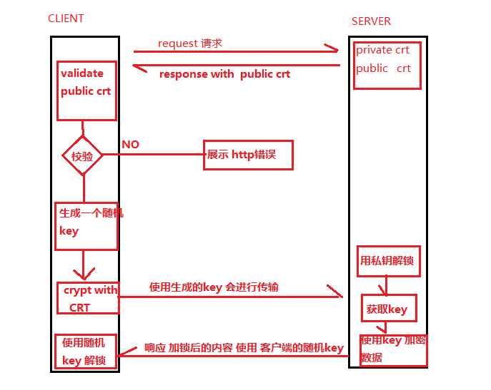

# https 安全

## 概述

HTTPS（Hypertext Transfer Protocol Secure）是一种通过计算机网络进行安全通信的传输协议。HTTPS经由HTTP进行通信，但利用TLS来加密数据包。HTTPS开发的主要目的，是提供对网站服务器的身份认证，保护交换数据的隐私与完整性

TLS是传输层加密协议，前身是SSL协议。由网景公司于1995年发布。后改名为TLS。常用的 TLS 协议版本有：TLS1.2, TLS1.1, TLS1.0 和 SSL3.0。其中 SSL3.0 由于 POODLE 攻击已经被证明不安全。TLS1.0 也存在部分安全漏洞，比如 RC4 和 BEAST 攻击

## 2. 原理

### 2.1 对称加密和非对称加密

对称加密 即加密和解密使用同一个密钥，虽然对称加密破解难度很大，但由于对称加密需要在网络上传输密钥和密文，一旦被黑客截取很容就能被破解，因此对称加密并不是一个较好的选择。

非对称加密 即加密和解密使用不同的密钥，分别称为公钥和私钥。我们可以用公钥对数据进行加密，但必须要用私钥才能解密。在网络上只需要传送公钥，私钥保存在服务端用于解密公钥加密后的密文。但是非对称加密消耗的CPU资源非常大，效率很低，严重影响HTTPS的性能和速度

因此HTTPS使用的对称和非堆成两种方式的组合，即使用对称加密要传输的数据（量大）,然后用非对称加密 '非对称加密的私钥'（数据量小，效率高）， 在服务端就可以通过私钥获取对称加密密钥，然后解密数据

TSL1.2的HTTPS握手过程

    1， 客户端发送 client_hello，包含一个随机数 random1。
    2， 服务端回复 server_hello，包含一个随机数 random2，携带了证书公钥 P。
    3， 客户端接收到 random2 之后就能够生成 premaster_secrect （对称加密的密钥）以及 master_secrect（用premaster_secret加密后的数据）。
    4， 客户端使用证书公钥 P 将 premaster_secrect 加密后发送给服务器 (用公钥P对premaster_secret加密)。
    5， 服务端使用私钥解密得到 premaster_secrect。又由于服务端之前就收到了随机数 1，所以服务端根据相同的生成算法，在相同的输入参数下，求出了相同的 master secrect。

### 2.2 SSL证书

    SSL证书采用公钥体制，即利用一对互相匹配的密钥对进行数据加密和解密。每个用户自己设定一把特定的、仅为本人所知的私有密钥（私钥），并用它进行解密和签名；同时设定一把公共密钥（公钥）并由本人公开，为一组用户所共享，用于加密和验证签名。

    由于密钥仅为本人所有，可以产生其他人无法生成的加密文件，也就是形成了数字签名

    SSL证书是一个经证书授权中心（CA）数字签名的、包含公开密钥拥有者信息以及公开密钥的文件。最简单的证书包含一个公开密钥、名称以及证书授权中心的数字签名。数字证书还有一个重要的特征就是只在特定的时间段内有效

    部署服务时，将公钥证书和私钥一起使用部署服务器。

    除了CA认证的证书，还有非CA机构即是不受信任的机构颁发的证书 以及 自签名证书（例如曾经的12306）

    详情可参考[阿里云SSL证书](https://help.aliyun.com/knowledge_detail/42216.html?spm=5176.13910061.0.0.5fe07a58RlP0bb&aly_as=o1d4MNQey)

#### 2.2.1    认证机构的工作
认证机构会生成一对秘钥, 公钥和私钥. 公钥证书的生成包括了两部分内容:
  1) 数字签名
  2) 服务器公钥

其中数字签名的生成过程是: 1). 服务器公钥 经过数字摘要算法 生成数字指纹 2). 把生成的数字指纹 在用认证机构的私钥加密 生成数字签名

#### 2.2.2 客户端验证服务端证书

即对比客户端内置的数字指纹和服务器的数字指纹是否一致，步骤如下: 

1. 客户端取出提前内置在手机内部的认证机构(CA)的公钥
2. 用认证机构(CA)的公钥去解密公钥证书里的数字签名 从而得到数字指纹
3. 客户端对公钥证书的服务器公钥进行 数字摘要算法 从而生成数字指纹
4. 对比客户端自己生成的数字指纹(第3步)和解密得到的数字指纹(第2步)是否一致 如果一致则公钥证书验证通过 就可以进行接下来的握手步骤了

## 3. 认证方式

### 3.1 信任所有证书

复写TrustManager不对任何证书做检测

### 3.2 单向加密

在客户端内置服务器的证书，我们在校验服务端证书的时候只比对和App内置的证书是否完全相同，如果不同则断开连接。那么此时再遭遇中间人攻击劫持我们的请求时由于黑客服务器没有相应的证书，此时HTTPS请求校验不通过，则无法与黑客的服务器建立起连接.

我们通常使用浏览器访问的网站大部分都是单向认证

### 3.3 双向加密

单向认证是客户端检测服务端，但是服务端不检测客户端。 而双向加密含义为 客户端校验服务端的证书，同时服务端也校验客户端证书。 一般用于金融等安全性要求校验的行业，保证自己的服务只有自己的客户端可以访问。

双向认证流程：

    a. 客户端发送一个连接请求给服务器。
    b. 服务器将自己的证书，以及同证书相关的信息发送给客户端。
    c. 客户端检查服务器送过来的证书是否和App内置证书相同。如果是，就继续执行协议；如果不是则终止此次请求。
    d. 接着客户端比较证书里的消息，例如域名和公钥，与服务器刚刚发送的相关消息是否一致，如果是一致的，客户端认可这个服务器的合法身份。
    e. 服务器要求客户发送客户自己的证书。收到后，服务器验证客户端的证书，如果没有通过验证，拒绝连接；如果通过验证，服务器获得用户的公钥。
    f. 客户端告诉服务器自己所能够支持的通讯对称密码方案。
    g. 服务器从客户发送过来的密码方案中，选择一种加密程度最高的密码方案，用客户的公钥加过密后通知客户端。
    h. 客户端针对这个密码方案，选择一个通话密钥，接着用服务器的公钥加过密后发送给服务器。
    i. 服务器接收到客户端送过来的消息，用自己的私钥解密，获得通话密钥。
    j. 服务器通过密钥解密客户端发送的被加密数据，得到明文数据。

## 4. 使用误区

### 4.1 对于CA机构颁发的证书客户端无须内置

正常我们访问一些公共网站往往不用配置证书，这是因为在系统中已经内置了所有CA机构的根证书，也就是只要是CA机构颁发的证书，系统是直接信任的。对于此种情况，虽然可以正常访问到服务器. 但是仍然存在安全隐患。

假如黑客自家搭建了一个服务器并申请到了CA证书，由于我们客户端没有内置服务器证书，默认信任所有CA证书（客户端可以访问所有持有由CA机构颁发的证书的服务器），那么黑客仍然可以发起中间人攻击劫持我们的请求到黑客的服务器，实际上就成了我们的客户端和黑客的服务器建立起了连接。

### 4.2 对于非CA机构颁发的证书和自签名证书，可以忽略证书校验

通常这种处理方式是信任所有的认证正式，但是这样的处理方式虽然解决了SSLHandshakeException异常，但是却存在更大的安全隐患。因为此种做法直接使我们的客户端信任了所有证书（包括CA机构颁发的证书和非CA机构颁发的证书以及自签名证书

参考 [关于HTTPS的那些事](https://blog.csdn.net/qq_20521573/article/details/79233793)

## 5. 证书的生成和提取

TODO 待补充

### 5.1 pcks7 to cer

    # 将证书从der格式转化为pem格式
    1. openssl pkcs7 -inform der -in _.anjuke.test -out safaricom_b2c_readable.p7b

    # 提取证书
    2. openssl pkcs7 -print_certs  -in safaricom_b2c_readable.p7b -out safaricom_b2c_readable.cer

## 6. https 交互流程图

1. 客户端发起HTTPS请求

　　这个没什么好说的，就是用户在浏览器里输入一个https网址，然后连接到server的443端口。

　　2. 服务端的配置

　　采用HTTPS协议的服务器必须要有一套数字证书，可以自己制作，也可以向组织申请。区别就是自己颁发的证书需要客户端验证通过，才可以继续访问，而使用受信任的公司申请的证书则不会弹出提示页面(startssl就是个不错的选择，有1年的免费服务)。这套证书其实就是一对公钥和私钥。如果对公钥和私钥不太理解，可以想象成一把钥匙和一个锁头，只是全世界只有你一个人有这把钥匙，你可以把锁头给别人，别人可以用这个锁把重要的东西锁起来，然后发给你，因为只有你一个人有这把钥匙，所以只有你才能看到被这把锁锁起来的东西。

　　3. 传送证书

　　这个证书其实就是公钥，只是包含了很多信息，如证书的颁发机构，过期时间等等。

　　4. 客户端解析证书

　　这部分工作是有客户端的TLS来完成的，首先会验证公钥是否有效，比如颁发机构，过期时间等等，如果发现异常，则会弹出一个警告框，提示证书存在问题。如果证书没有问题，那么就生成一个随机值。然后用证书对该随机值进行加密。就好像上面说的，把随机值用锁头锁起来，这样除非有钥匙，不然看不到被锁住的内容。

    ``TIP``:
        我们通常在使用时，有时为了使用方便，会在客户端设置信任所有证书，设置的就是这里。让客户端信任所有的服务端证书，然后仍按照流程使用证书生成随机key，即主流程不变，只是不在校验正式的合法性

　　5. 传送加密信息

　　这部分传送的是用证书加密后的随机值，目的就是让服务端得到这个随机值，以后客户端和服务端的通信就可以通过这个随机值来进行加密解密了。

　　6. 服务段解密信息

　　服务端用私钥解密后，得到了客户端传过来的随机值(私钥)，然后把内容通过该值进行对称加密。所谓对称加密就是，将信息和私钥通过某种算法混合在一起，这样除非知道私钥，不然无法获取内容，而正好客户端和服务端都知道这个私钥，所以只要加密算法够彪悍，私钥够复杂，数据就够安全。

　　7. 传输加密后的信息

　　这部分信息是服务段用私钥加密后的信息，可以在客户端被还原。

　　8. 客户端解密信息

　　客户端用之前生成的私钥解密服务段传过来的信息，于是获取了解密后的内容。整个过程第三方即使监听到了数据，也束手无策。