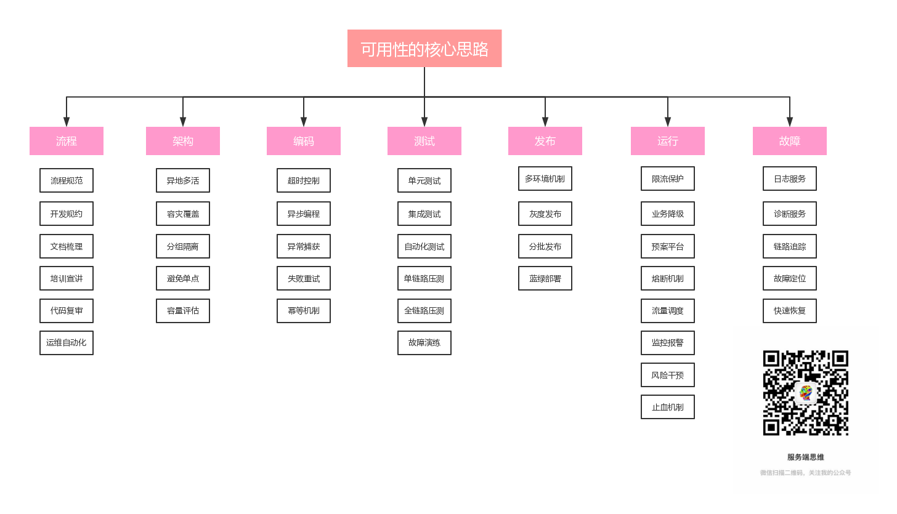

# 可用性衡量

## 时间范围

| 可用性(%) |  一年故障时长 |  一天故障时长 |
| -- | -- | -- | -- |
| 90     | 35.6天  | 144分钟 | 
| 99     | 3.6天   | 14.4 分钟 ｜
| 99.9   | 8.8 h  ｜ 86.4s |
| 99.99  | 52.6min| 8.6s  |
| 99.999 | 5.3min | 860ms|
| 99.9999| 31.5s | 86ms |

## 服务保障

