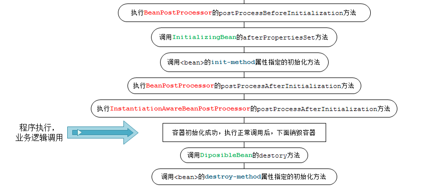

## spring 生命周期

Spring Bean的完整生命周期从创建Spring容器开始，直到最终Spring容器销毁Bean, 图示如下：

Bean的完整生命周期经历了各种方法调用, 大致可以分为：

    1、Bean自身的方法: 包括Bean本身调用的方法和通过配置文件中<bean>的init-method和destroy-method指定的方法

    2、Bean级生命周期接口方法: 包括BeanNameAware、BeanFactoryAware、InitializingBean和DiposableBean这些接口的方法

    3、容器级生命周期接口方法: 包括InstantiationAwareBeanPostProcessor 和 BeanPostProcessor 这两个接口实现，一般称它们的实现类为“后处理器”。

    4、工厂后处理器接口方法: 包括AspectJWeavingEnabler, ConfigurationClassPostProcessor, CustomAutowireConfigurer等等非常有用的工厂后处理器接口的方法。工厂后处理器也是容器级的。在应用上下文装配配置文件之后立即调用。
