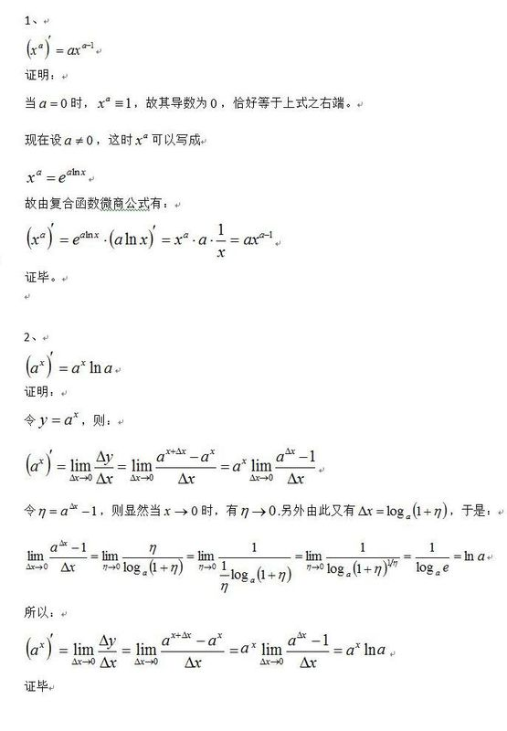

.. _records_mechine_theory_math:

.. toctree::
   :maxdepth: 2
   :glob:

数学学习
^^^^^^^^^

0. argmax
   是一种函数，函数y=f(x)，x0= argmax(f(x)) 的意思就是参数x0满足f(x0)为f(x)的最大值；即 argmax(f(x))是使得 f(x)取得最大值所对应的变量x。arg即argument，此处意为“自变量”。

1. 中位数（中值） 和 平均数

::
    中值也称中位数, 如果数据是奇数个，那大小最中间那个就是, 如果数据是偶数个，那个取中间2位的平均值
    平均数是指所有数值的总和然后除以数的总数

导数求解
=========

* lnx的导数

::

    设y=lnx
    e^y=x
    两边分别求导
    e^y*y'=1
    y'=1/e^y=e^(-y)=e^(-lnx)=e^ln(1/x)=1/x

* a^x的导数

::
    a=e^lna
    y=a^x=(e^(lna))^x=(e^x)^lna
    以上复合函数求导y‘=lna*(e^x)^(lna-1)*e^x=lna*(e^x)^lna=lna*(e^lna)^x=lna*a^x
    y=a^x的导数为y’=lna*a^x可以当做公式记忆,以上是推导过程.

泊松分布
'''''''''

概率密度pdf和累计分布cdf 核密度估计（kernel density estimation, KDE)
'''''''''''''''''''''''''''''''''''''''''''''''''''''''''''''''''''''''

广义线性模型(generalized liner model GLM)
''''''''''''''''''''''''''''''''''''''''''''''

https://blog.csdn.net/weixin_37140379/article/details/82289704

