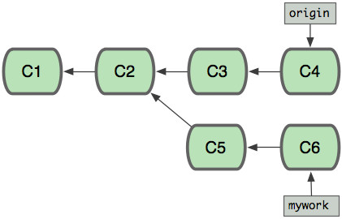

# rebase 和 merge的区别

### 两种方式的git图示
两个人同时开发一个分支，当前的git分支如下
<div align=left>


</div>

1). 如果使用git merge的方式，当前分支与要merge的分支，会合并到同一个节点。融合后的git图示如下：
<div align=left>


</div>

2). 如果使用git rebase的方式，拷贝老分支作为新的分支添加的rebase的分支后面，老的分支会被删除掉，所有的提交记录都会被融合成一个。融合后的git图示如下：
<div align=left>

</div>


### 冲突解决
在rebase过程中，可能会遇到代码冲突，可以手动编辑解决冲突，然后git add \$xx 解决，然后执行命令
```
git rebase --continue
```
如果希望终止本次合并，那么可以使用命令
```
git rebase --abort
```

### merge 和 rebase 之后的区别
当我们使用Git log来参看commit时，其commit的顺序也有所不同。
```
假设C3提交于9:00AM,C5提交于10:00AM,C4提交于11:00AM，C6提交于12:00AM,
使用git merge来合并所看到的commit的顺序（从新到旧）是：C7 ,C6,C4,C5,C3,C2,C1
使用git rebase来合并所看到的commit的顺序（从新到旧）是：C7 ,C6‘,C5',C4,C3,C2,C1
因为C6'提交只是C6提交的克隆，C5'提交只是C5提交的克隆，
从用户的角度看使用git rebase来合并后所看到的commit的顺序（从新到旧）是：C7 ,C6,C5,C4,C3,C2,C1
```

参考地址：[rebase学习](http://gitbook.liuhui998.com/4_2.html)
