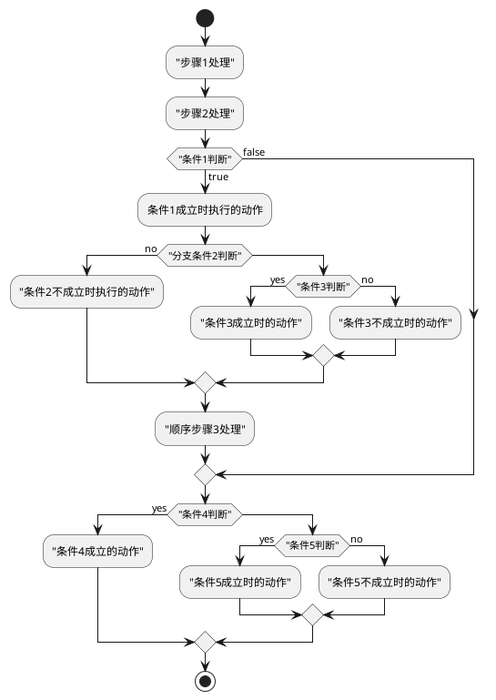
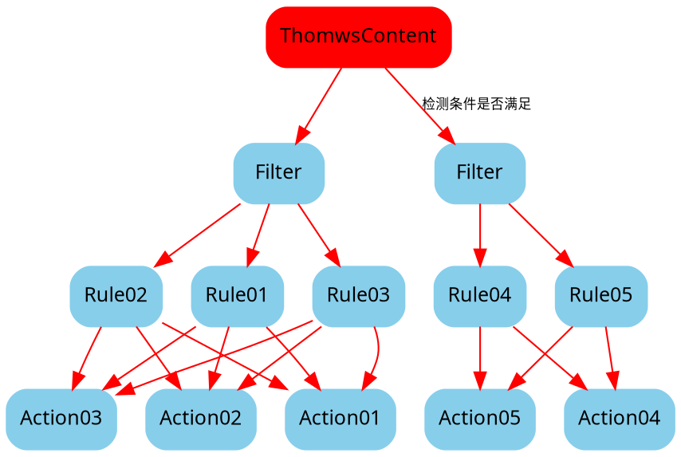
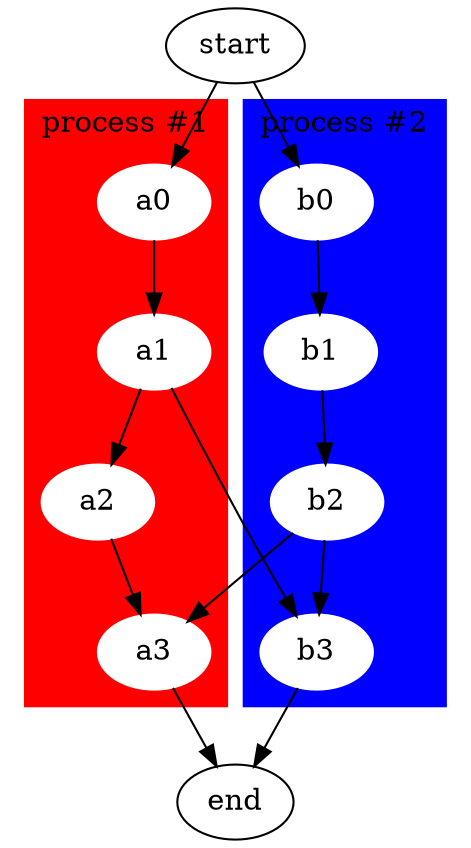
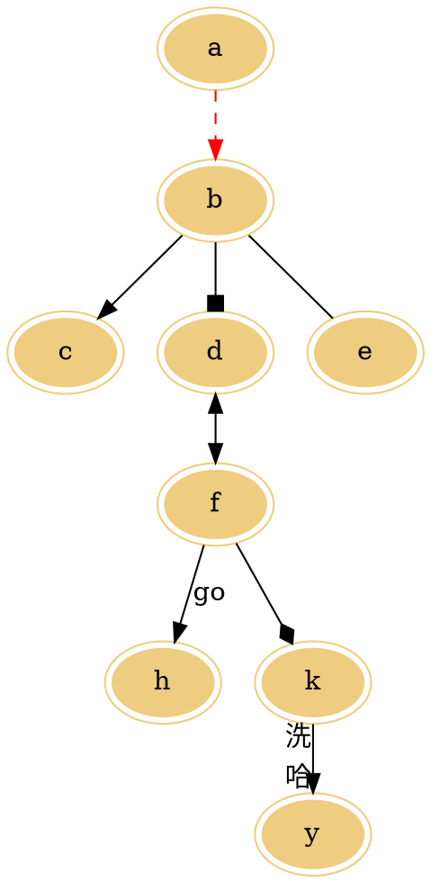

# markdown 画图

## 流程图

使用 plantUml + graphviz 

``` puml
@startuml
start
:"步骤1处理";
:"步骤2处理";
if ("条件1判断") then (true)
    :条件1成立时执行的动作;
    if ("分支条件2判断") then (no)
        :"条件2不成立时执行的动作";
    else
        if ("条件3判断") then (yes)
            :"条件3成立时的动作";
        else (no)
            :"条件3不成立时的动作";
        endif
    endif
    :"顺序步骤3处理";
else (false)
endif

if ("条件4判断") then (yes)
:"条件4成立的动作";
else
    if ("条件5判断") then (yes)
        :"条件5成立时的动作";
    else (no)
        :"条件5不成立时的动作";
    endif
endif
stop
@enduml
```

```dot

digraph G{

node[fontname = "Microsoft YaHei", fontsize = 12, shape = "Mrecord", color="skyblue", style="filled"]
edge[fontname = "Microsoft YaHei", fontsize = 8, color="red" ]

    // 执行单元1
    A -> B 
    B -> D
    B -> E
    B -> F
    D -> I
    D -> J
    D -> K
    E -> I
    E -> J
    E -> K
    F -> I
    F -> J
    F -> K

// 执行单元 2
    A -> C[label="检测条件是否满足"]
    C -> G
    C -> H
    G -> L
    H -> L
    G -> M
    H -> M

A[label="ThomwsContent",color="red",style=filled];
B[label="Filter"]
C[label="Filter"]
D[label="Rule01"]
E[label="Rule02"]
F[label="Rule03"]
G[label="Rule04"]
H[label="Rule05"]
I[label="Action01"]
J[label="Action02"]
K[label="Action03"]
L[label="Action04"]
M[label="Action05"]
}

```

```dot 

digraph g {
    subgraph cluster0 {
        node[style=filled, color=white];
        style=filled; //定义子图的样式
        color=red; //定义子图的填充色
        a0->a1->a2->a3; //定义节点, 及节点之间的关系
        label="process #1"; //定义子图的标签
     }
 
   //又定义一个子图
   subgraph cluster1 {
      node[style=filled, color=white];
      style=filled;
      color=blue; //定义子图的填充色
      b0->b1->b2->b3; //定义节点及其关系
      label="process #2";
      labelColor=white;
   }
 
    //定义子图之间的关系
    start->a0;
    start->b0;
    a1->b3;
    b2->a3;
    a3->end;
    b3->end;
}

```

```dot 
digraph g {
  //edge[style=dashed]; //定义边的样式, 虚线
  node[peripheries=2, style=filled, color="#eecc80"];
  a->b [color=red, style=dashed]; //定义边的颜色, 红色 (b和方括号之间必须有空格)
  b->c; //箭头, 三角形; 箭尾, 菱形
  b->d [arrowhead=box]; //箭头, 长方形
  b->e [dir=none]; //没有箭头
  d->f [dir=both]; //双向箭头
  f->h [label=go]; //定义edge的标签
  f->k [arrowhead=diamond]; //更改箭头形状 (更多箭头形状请参考官方文档: http://www.graphviz.org/content/arrow-shapes)
  k->y [headlabel="哈", taillabel="洗"];
}
```